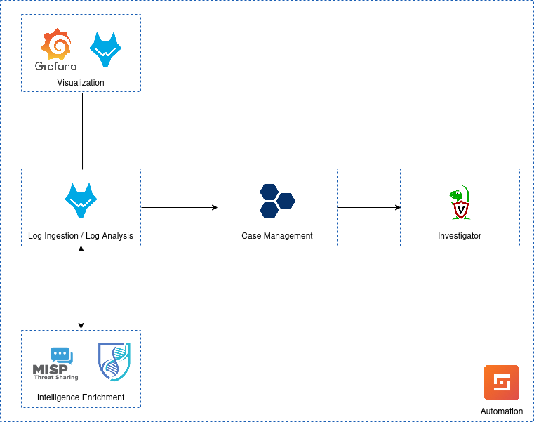

# MakaraSOC: Comprehensive SOC Management Package

---

## Overview

**MakaraSOC** is a modular, open-source Security Operations Center (SOC) management package designed to simplify the deployment, management, and testing of SOC platforms. Developed collaboratively **idCARE UI** and **Socarium Team**, supported by **UI-JICA Project Cybersecurity**, MakaraSOC integrates industry-standard tools like Wazuh, DFIR IRIS, Shuffle, MISP, Velociraptor, and OpenCTI, providing a streamlined approach to cybersecurity monitoring, analysis, and incident response.

  <h3 align="center">System Overview</h3>

  

     
    
     
     
  

---

## Features

1. **Modular Design**
   - Each SOC platform is managed independently, ensuring flexibility and scalability.

2. **Centralized Management**
   - A single `main.sh` script handles installation, configuration, and management.

3. **Integrated Proof of Concept (PoC) Testing**
   - Attack simulations included to validate platform functionality.

4. **Extensive Documentation**
   - Platform-specific guides and troubleshooting tips included.

5. **Open Source Collaboration**
   - Freely available under the MIT License for contributions and enhancements.

---

## Repository Structure

| **Folder/File**             | **Purpose**                                                                |
|-----------------------------|----------------------------------------------------------------------------|
| `main.sh`                   | Main script to install, configure, and manage all SOC platforms.           |
| `health_check.sh`           | Script check for the docker installation before the deploys.               |
| `install_all.sh`            | Script install the main tools of SOC package with single option.           |
| `install_prerequisites.sh`  | Script to install all dependencies are needed for the deployment.          |
| `README.md`                 | Comprehensive guide for using and understanding the repository.            |
| `modules/`                  | Contains Docker Compose configurations for SOC platforms.                  |
| `config/`                   | Contain configuration of the dockers environtment.                         |

---

## Prerequisites

### **Minimum System Requirements**

- **Memory:** Minimum 16GB RAM.
- **Disk Space:** At least 100GB of free space.
- **Operating System:** Linux (Ubuntu recommended).

---

## Installation and Setup

Installation and configuration manuals please refers into [Wiki's](https://github.com/socarium/makarasoc/wiki).

---

## Proof of Concept (PoC) Coming soon

The `poc/` folder contains scripts and descriptions for attack simulations:

### **Attack Simulations**

| **Simulation**            | **Description**                                                                 |
|---------------------------|---------------------------------------------------------------------------------|
| **Brute Force Attack**    | Simulates multiple failed login attempts to test detection capabilities.        |

---

## Contributing

We welcome contributions to improve MakaraSOC. Please submit issues or pull requests on the repository.

---

## License

This project is licensed under the **MIT License**. See the LICENSE file for details.

